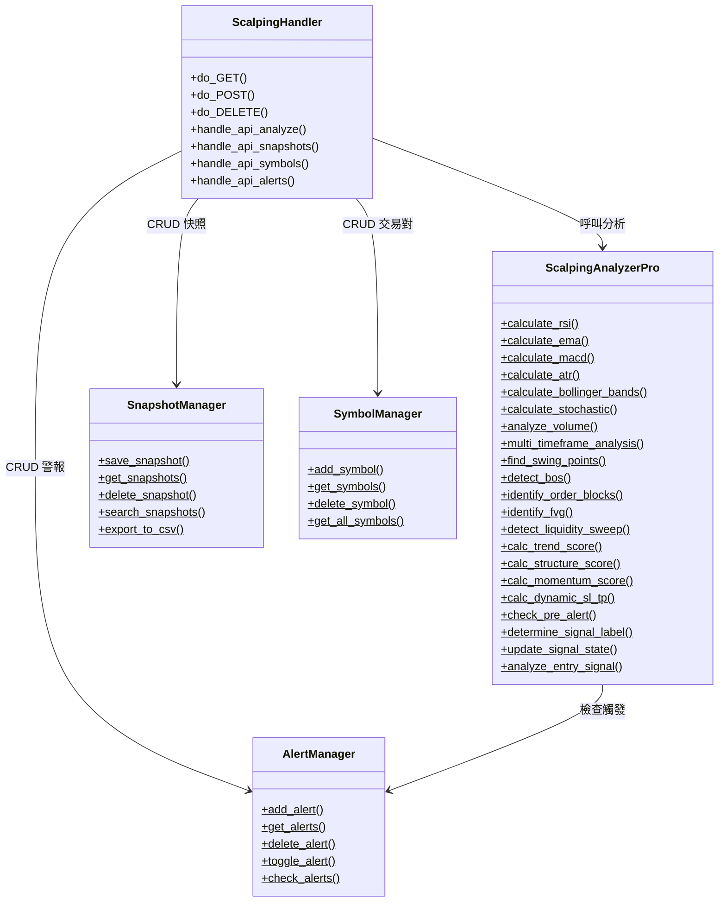
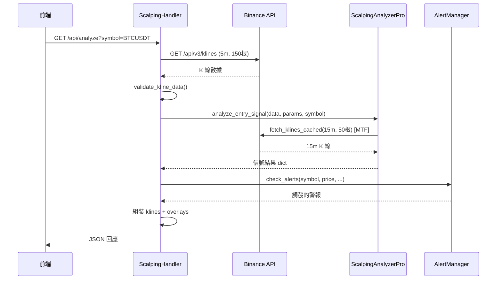
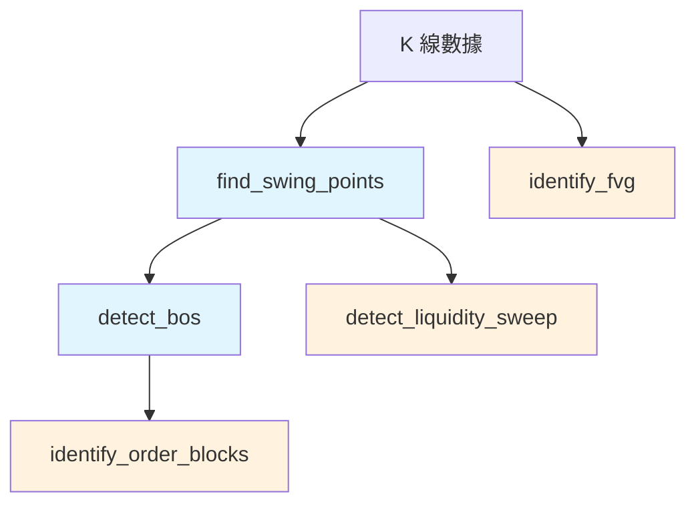
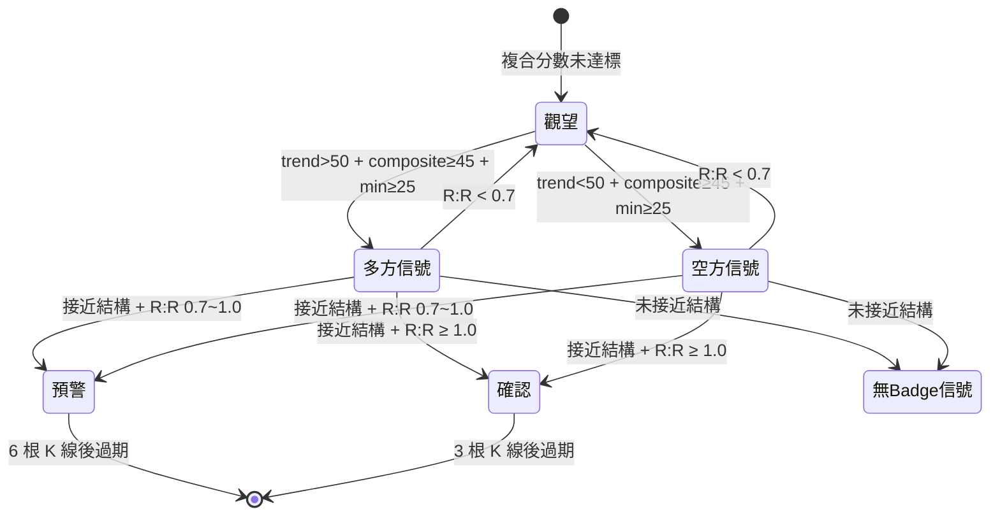

# Scalping Trade Analyzer Pro — 開發者指南

> 版本：v4.2.1 | `app_v3.py` — 單檔 monolith 架構（約 5,560 行）

---

## 目錄

1. [架構總覽](#1-架構總覽)
2. [核心模組詳解](#2-核心模組詳解)
3. [數據層](#3-數據層)
4. [SMC 引擎](#4-smc-引擎)
5. [評分與信號系統](#5-評分與信號系統)
6. [前端架構](#6-前端架構)
7. [設計決策](#7-設計決策)
8. [擴展指南](#8-擴展指南)

---

## 1. 架構總覽

### 單檔 Monolith 設計

整個系統在一個 Python 檔案 `app_v3.py` 中，包含：
- **後端 HTTP 伺服器**（Python 標準庫 `http.server` + `socketserver`）
- **分析引擎**（純 Python 計算，無第三方依賴）
- **嵌入式前端**（HTML/CSS/JS 以字串常量 `HTML_PAGE` 存放）

```
app_v3.py (5,560 行)
├── L1-31      imports + parse_port() + parse_prefix()
├── L70-230    輔助函式：fetch_with_retry / classify_error / validate_kline / fetch_klines_cached
├── L231       全域狀態：_signal_state / _mtf_cache
├── L236-540   管理器類別：SnapshotManager / AlertManager / SymbolManager
├── L544-555   FIXED_PARAMS（固定分析參數）
├── L558-695   SymbolManager
├── L696-2190  ScalpingAnalyzerPro（分析引擎核心）
├── L2193-2400 ScalpingHandler（HTTP 路由處理）
├── L2400-5539 HTML_PAGE（嵌入式前端）
└── L5541-5558 主程式入口
```

### 類別關係圖



> 所有類別的方法都是 `@staticmethod`，不使用實例狀態。

### 請求生命週期



---

## 2. 核心模組詳解

### 2.1 ScalpingHandler

繼承 `http.server.SimpleHTTPRequestHandler`，負責 HTTP 路由分派。

**端點對應表**：

| 方法 | 路徑 | 處理函式 | 說明 |
|------|------|----------|------|
| GET | `/` | — | 回傳 `HTML_PAGE` |
| GET | `/api/analyze` | `handle_api_analyze()` | 核心分析（L2248） |
| GET | `/api/snapshots` | `handle_api_snapshots()` | 快照列表 |
| GET | `/api/snapshots/search` | `handle_search_snapshots()` | 快照搜尋 |
| GET | `/api/snapshots/export` | `handle_export_snapshots()` | CSV 匯出 |
| GET | `/api/symbols` | `handle_api_symbols()` | 交易對列表 |
| GET | `/api/supported_symbols` | `handle_api_supported_symbols()` | 支援的交易對 |
| GET | `/api/alerts` | `handle_api_alerts()` | 警報列表 |
| POST | `/api/snapshot/save` | `handle_save_snapshot()` | 儲存快照 |
| POST | `/api/symbol/add` | `handle_add_symbol()` | 新增交易對 |
| POST | `/api/alert/add` | `handle_add_alert()` | 新增警報 |
| POST | `/api/alert/toggle` | `handle_toggle_alert()` | 啟停警報 |
| DELETE | `/api/snapshot/{id}` | `handle_delete_snapshot()` | 刪除快照 |
| DELETE | `/api/symbol/{symbol}` | `handle_delete_symbol()` | 刪除交易對 |
| DELETE | `/api/alert/{id}` | `handle_delete_alert()` | 刪除警報 |

所有路徑支援 `PREFIX` 前綴（`--prefix` 參數），用於 nginx 反向代理部署。

### 2.2 ScalpingAnalyzerPro

純靜態方法分析引擎，可分為四層：

| 層級 | 方法群 | 行號 |
|------|--------|------|
| 指標計算 | `calculate_rsi/ema/macd/atr/bollinger_bands/stochastic` | L696-827 |
| 時間序列 | `compute_ema_series/compute_bb_series` | L830-865 |
| 輔助分析 | `analyze_volume/multi_timeframe_analysis/calculate_stop_loss_take_profit` | L867-971 |
| SMC 引擎 | `find_swing_points/detect_bos/identify_order_blocks/identify_fvg/detect_liquidity_sweep` | L977-1364 |
| 三維評分 | `calc_trend_score/calc_structure_score/calc_momentum_score` | L1370-1676 |
| SL/TP | `calc_dynamic_sl_tp` | L1679-1822 |
| 信號系統 | `check_pre_alert/determine_signal_label/update_signal_state` | L1828-1955 |
| 主入口 | `analyze_entry_signal` | L1958-2190 |

### 2.3 SnapshotManager

管理策略快照，持久化到 `snapshots.json`。

| 方法 | 說明 | 限制 |
|------|------|------|
| `save_snapshot()` | 儲存信號快照 | 最多 100 筆，超過自動裁剪 |
| `get_snapshots(limit)` | 取得快照列表（倒序） | 預設 20 筆 |
| `delete_snapshot(id)` | 依 ID 刪除 | — |
| `search_snapshots(query)` | 依 symbol/action 搜尋 | — |
| `export_to_csv()` | 匯出全部為 CSV | — |

### 2.4 SymbolManager

管理自定義交易對，持久化到 `custom_symbols.json`。新增時會向 Binance API 驗證交易對是否存在。

### 2.5 AlertManager

管理智能警報，持久化到 `alerts.json`。

**警報類型**：

| 類型 | 觸發條件 | 範例 |
|------|----------|------|
| `price` | 價格突破/跌破指定值 | BTC > 100000 |
| `quality` | 品質分數達到門檻 | quality_score ≥ 4.0 |
| `signal` | 出現指定信號 | action 包含 "買入" |

每次 `handle_api_analyze` 都會呼叫 `check_alerts()`，檢查並更新觸發記錄。

---

## 3. 數據層

### 3.1 fetch_with_retry()（L70）

HTTP 請求封裝，支援指數退避重試。

```python
fetch_with_retry(url, is_kline_req=False, max_retries=3, base_timeout=10)
```

**重試策略**：
- 第 1 次失敗：等 1 秒
- 第 2 次失敗：等 2 秒
- 第 3 次失敗：放棄
- HTTP 400 錯誤**不重試**（請求本身有誤）
- HTTP 429 重試（速率限制）
- HTTP 5xx 重試（伺服器錯誤）

**SSL**：使用 `ssl.CERT_NONE` 跳過 SSL 驗證（適用於部分網路環境）。

### 3.2 classify_error()（L113）

將例外分類為結構化中文錯誤訊息：

| 錯誤類型 | error_type | 範例 |
|----------|------------|------|
| HTTP 錯誤 | `http_{code}` | "伺服器返回錯誤碼: 403" |
| 逾時 | `timeout` | "連線逾時，請檢查網路" |
| 未知 | `unknown` | "發生未知錯誤: ..." |

### 3.3 validate_kline_data()（L153）

```python
validate_kline_data(data, min_count=50) -> (is_valid, cleaned_data, warnings)
```

驗證四項：
1. **數量** ≥ `min_count`
2. **零成交量** K 線（跳過，最後一根除外）
3. **時間戳連續性**（非遞增則跳過）
4. **異常波動** > 50%（保留但記錄警告）

### 3.4 fetch_klines_cached()（L204）

MTF 快取，避免對同一根未收盤 K 線重複請求。

```python
_mtf_cache = {}  # key: "{symbol}_{interval}"

# 快取結構
{
    'data': [...],          # K 線數據
    'last_close_time': int, # 最後一根 K 線收盤時間 (ms)
    'fetched_at': float     # 取得時間 (epoch)
}
```

**快取邏輯**：如果當前時間 < 最後一根 K 線的收盤時間，使用快取。否則重新請求。

> 注意：主分析端點 `/api/analyze` **不使用快取**（直接 `fetch_with_retry`），確保每次刷新取得最新價格。只有 MTF 確認（15m）使用快取。

### 3.5 資料檔案格式

#### snapshots.json

```json
[
  {
    "id": 1,
    "timestamp": "2026-03-16T10:30:00",
    "symbol": "BTCUSDT",
    "price": 84000.5,
    "action": "考慮買入",
    "quality_score": 3.5,
    "strength": 1.5,
    "parameters": { "rsi_period": 14, ... },
    "signals": { "rsi": {...}, "ema": {...}, ... }
  }
]
```

#### custom_symbols.json

```json
[
  { "symbol": "DOGEUSDT", "name": "DOGE/USDT" }
]
```

#### alerts.json

```json
[
  {
    "id": 1,
    "type": "price",
    "symbol": "BTCUSDT",
    "condition": "above",
    "value": 100000,
    "enabled": true,
    "created_at": "2026-03-16T10:00:00",
    "triggered_count": 0,
    "last_triggered": null
  }
]
```

---

## 4. SMC 引擎

### 依賴鏈



- `find_swing_points` 和 `identify_fvg` 只依賴原始 K 線數據
- `detect_bos` 依賴 Swing Points
- `identify_order_blocks` 依賴 BOS 列表
- `detect_liquidity_sweep` 依賴 Swing Points + ATR

### 資料結構

#### Swing Point

```python
{
    'type': 'high' | 'low',
    'price': float,      # Swing High 的最高價 / Swing Low 的最低價
    'index': int,         # K 線索引
    'time': int           # 時間戳 (ms)
}
```

#### BOS

```python
{
    'direction': 'bullish' | 'bearish',
    'break_price': float,   # 突破時的收盤價
    'break_index': int,     # 突破的 K 線索引
    'swing_price': float,   # 被突破的擺動點價格
    'time': int
}
```

#### Order Block

```python
{
    'type': 'bullish' | 'bearish',  # 多方 OB = 支撐，空方 OB = 阻力
    'top': float,                    # OB 區域上緣 = max(open, close)
    'bottom': float,                 # OB 區域下緣 = min(open, close)
    'index': int,
    'time': int,
    'touches': 0,                    # 被碰觸次數
    'bos_direction': str             # 對應的 BOS 方向
}
```

#### FVG

```python
{
    'type': 'bullish' | 'bearish',
    'top': float,            # 缺口上緣
    'bottom': float,         # 缺口下緣
    'index': int,            # 中間 K 線索引
    'time': int,
    'filled_pct': float      # 填補率 0.0-1.0
}
```

#### Liquidity Sweep

```python
{
    'type': 'bullish' | 'bearish',   # 掃低 = bullish, 掃高 = bearish
    'sweep_price': float,             # 掃蕩時的極端價
    'swing_price': float,             # 被掃的擺動點價格
    'index': int,
    'time': int,
    'depth': float,                   # 穿透深度
    'strength': 'full' | 'partial' | 'near'
}
```

### 保留上限

| 元件 | 上限 | 原因 |
|------|------|------|
| Swing Points | 20 | 足夠涵蓋近期結構，避免過多遠期點干擾 |
| Order Blocks | 5 | 有效 OB 通常不多，保留最新的 |
| FVG | 3 | 遠期 FVG 大多已被填補 |
| Sweeps | 5 | 與 Swing Points 類似，保留近期 |
| BOS | 無上限 | 全部保留，用於趨勢判定 |

---

## 5. 評分與信號系統

### 5.1 三維評分

#### 趨勢分數正規化

```
raw ∈ [-100, +100]
score = clamp(raw + 50, 0, 100)
```

原始分為各元件的代數和（正 = 多方，負 = 空方），加 50 後映射到 0-100。

#### 結構分數 / 動能分數

直接累加（無正規化），最後 clamp 到 [0, 100]。

#### 權重表

完整權重見 [交易者指南](trading-guide.md#4-三維評分系統)。

### 5.2 信號判定狀態機



### 5.3 門檻矩陣

| 門檻 | normal | strong |
|------|--------|--------|
| 複合分數 | ≥ 45 | ≥ 55 |
| 最低分 (min_floor) | ≥ 25 | ≥ 30 |
| 趨勢分數（多方） | ≥ 45 | ≥ 55 |
| 趨勢分數（空方） | ≤ 55 | ≤ 45 |

### 5.4 SL/TP 錨定優先序

**買入止損**：bullish OB bottom → Swing Low → ATR×1.5
**買入止盈**：bearish FVG bottom / bearish OB bottom / Swing High（排序後取最近）

ATR 夾鉗：`max(ATR×1.0, min(ATR×2.5, distance))`

**R:R 分級**：

| R:R | rr_grade | 處理 |
|-----|----------|------|
| < 0.7 | — | `calc_dynamic_sl_tp()` 回傳 `None` |
| 0.7-1.0 | `caution` | `signal_stage` 降級為 `pre_alert` |
| ≥ 1.0 | `acceptable` | `signal_stage = confirmed` |
| ≥ 1.5 | `good` | `signal_stage = confirmed` |

---

## 6. 前端架構

### 6.1 HTML_PAGE 嵌入結構

`HTML_PAGE` 是一個約 3,100 行的字串常量（L2400-5539），包含：

```
HTML_PAGE = """
<!DOCTYPE html>
<html>
<head>
    <style> ... CSS (約 1,000 行) ... </style>
</head>
<body>
    ... HTML 結構 ...
    <script src="https://unpkg.com/lightweight-charts/dist/lightweight-charts.standalone.production.js"></script>
    <script> ... JS (約 1,500 行) ... </script>
</body>
</html>
"""
```

Server 在回傳前注入 `APP_PREFIX` 和 `APP_VERSION`：

```python
html = HTML_PAGE.replace(
    '<head>',
    f'<head><script>window.APP_PREFIX = "{PREFIX}"; window.APP_VERSION = "{VERSION}";</script>',
    1
)
```

### 6.2 i18n 機制

**靜態文字**：使用 `data-i18n` 屬性標記 HTML 元素，`applyLang()` 根據 `currentLang` 設定文字。

```html
<span data-i18n="trend_score">趨勢分數</span>
```

**動態文字**：在 JS 中使用 `LANG[currentLang].key` 取得翻譯。

```javascript
const LANG = {
    EN: { trend_score: 'Trend Score', ... },
    ZH_TW: { trend_score: '趨勢分數', ... }
};
```

**API 回應轉換**：`translateAction(action)` 將後端固定回傳的中文 action 字串轉換為當前語言顯示。後端 action 永遠是中文。

### 6.3 圖表整合

使用 TradingView Lightweight Charts（透過 CDN 載入），顯示：
- 主圖：K 線 (candlestick)
- 覆蓋：EMA(9)、EMA(21)、Bollinger Bands (upper/lower)
- 副圖：成交量柱狀圖

### 6.4 狀態持久化（localStorage）

| Key | 用途 |
|-----|------|
| 側邊欄折疊狀態 | 記住使用者是否收合側邊欄 |
| 分析面板折疊狀態 | 記住各個分析區塊的展開/收合 |
| 語言偏好 | EN 或 ZH_TW |
| 自動刷新間隔 | 2-10 秒 |
| 警報 cooldown | 預設 60 秒 |

---

## 7. 設計決策

### 7.1 為什麼 Structure 權重最高（0.40）

Structure（結構分數）包含 OB、FVG、Sweep 等 SMC 核心元件。在剝頭皮策略中，進場位置比趨勢方向更關鍵——即使趨勢正確，如果不在結構位置進場，止損會過大，R:R 不划算。0.40 的權重確保只有在結構位置附近才會產生高分信號。

### 7.2 為什麼 R:R < 0.7 直接拒絕

R:R < 1.0 已經意味著風險大於回報。設定 0.7 而非 1.0 作為硬性門檻是為了：
- 允許 0.7-1.0 區間作為「謹慎」等級，提供資訊但降級為預警
- < 0.7 代表風險遠大於潛在回報，在任何情況下都不應該進場

### 7.3 為什麼用兩階段而非直接出信號

單階段信號的問題是：三維分數達標但價格不在結構附近時，信號缺乏精確的進場點。兩階段機制：
1. **預警**：提醒交易者「即將接近進場區域」，有時間做準備
2. **確認**：價格到達結構 + 三維達標 + R:R 合理，此時才給出完整信號

這降低了在非理想位置追價的風險。

### 7.4 為什麼 Sweep 分三級

早期只有「有 Sweep」和「沒有 Sweep」兩種狀態。問題是：
- 有些 Sweep 只是 wick 輕碰，沒有實質反轉（Near）
- 有些 wick 穿透但收盤沒反轉（Partial）
- 只有穿透 + 反轉 + 確認的才是高品質 Sweep（Full）

三級分類讓評分更精確，避免所有 Sweep 都給予同等權重。

### 7.5 為什麼單檔架構而非拆分模組

- **部署極簡**：複製一個檔案即可運行，適合在 VPS 上快速部署
- **無依賴**：純 Python 標準庫，不需要 pip install
- **前端嵌入**：無需打包工具，不需要 Node.js 環境
- **折衷**：犧牲了程式碼組織性，但對於單人維護的專案，一個檔案加上明確的區段劃分已經足夠

### 7.6 並發與多使用者

**伺服器模型**：`socketserver.TCPServer`（單執行緒），一次處理一個請求。

**全域狀態**：

| 變數 | 類型 | 影響 |
|------|------|------|
| `_signal_state` | `dict` | 以 `{symbol}_{interval}` 為 key 的信號狀態追蹤。不同使用者查詢同一交易對會共用同一份狀態 |
| `_mtf_cache` | `dict` | MTF K 線快取，唯讀性質，無副作用 |

**實際影響**：
- 每次分析都是純函數計算（`ScalpingAnalyzerPro` 全部 `@staticmethod`），不依賴全域可變狀態
- `_signal_state` 是唯一的共用可變狀態，但同一交易對的市場數據相同，所以分析結果基本一致
- 持久化檔案（snapshots.json、alerts.json）是共用的，多人使用時會看到相同的快照和警報

**如需多人隔離**（未來），需要：
- 將 `_signal_state` 改為 per-session 存儲
- 持久化檔案加入使用者維度
- 考慮使用 `ThreadingMixIn` 支援並發請求

---

## 8. 擴展指南

### 8.1 新增技術指標

**步驟**：

1. 在 `ScalpingAnalyzerPro` 類別中新增 `calculate_xxx()` 靜態方法
2. 在 `analyze_entry_signal()` 中呼叫計算（L1964 附近）
3. 將結果整合到對應的評分方法中（通常是 `calc_momentum_score`）
4. 在回傳的 `signals` dict 中加入新欄位（L2118）
5. 前端在 JS 中新增對應的顯示區塊

**注意事項**：
- 確保新指標在 150 根 K 線下有足夠數據
- 使用 `round()` 控制精度
- 所有方法必須是 `@staticmethod`

### 8.2 修改評分權重

**位置**：

| 權重 | 位置 | 目前值 |
|------|------|--------|
| 三維複合 | `analyze_entry_signal()` L2018 | 0.35 / 0.40 / 0.25 |
| 趨勢各元件 | `calc_trend_score()` L1370-1440 | BOS ±30, MTF ±25/10, EMA ±15, etc. |
| 結構各元件 | `calc_structure_score()` L1443-1526 | OB +30, Sweep +25/15/8, etc. |
| 動能各元件 | `calc_momentum_score()` L1529-1676 | RSI +20, MACD +20, etc. |

**注意事項**：
- 修改趨勢分數元件時，注意 raw 範圍仍應在 [-100, +100] 附近，因為正規化是 `raw + 50`
- 結構分數和動能分數是直接累加後 clamp [0, 100]，確保合計不會輕易超過 100
- 修改門檻值（composite ≥ 45/55, min_floor ≥ 25/30）在 `analyze_entry_signal()` L2022-2060

### 8.3 新增 API 端點

**步驟**：

1. 在 `ScalpingHandler` 的 `do_GET()`、`do_POST()` 或 `do_DELETE()` 中新增路由判斷
2. 實作對應的 `handle_xxx()` 方法
3. 回應格式：

```python
def handle_xxx(self):
    try:
        # 處理邏輯
        result = {'success': True, 'data': ...}
        self.send_response(200)
        self.send_header('Content-type', 'application/json; charset=utf-8')
        self.end_headers()
        self.wfile.write(json.dumps(result, ensure_ascii=False).encode('utf-8'))
    except Exception as e:
        self.send_response(500)
        self.send_header('Content-type', 'application/json')
        self.end_headers()
        self.wfile.write(json.dumps({'error': str(e)}).encode('utf-8'))
```

4. 前端對應新增 `fetch()` 呼叫

**注意**：路徑要加上 `p = PREFIX` 前綴支援。

### 8.4 新增 SMC 元件

**步驟**：

1. 在 `ScalpingAnalyzerPro` 中新增偵測方法（建議放在 SMC 引擎區段 L977-1364）
2. 確認依賴關係，在 `analyze_entry_signal()` 中按正確順序呼叫
3. 將結果整合到 `calc_structure_score()` 中，新增對應的計分規則
4. 考慮是否需要影響 `check_pre_alert()`（預警觸發條件）
5. 考慮是否需要影響 `calc_dynamic_sl_tp()`（SL/TP 錨定點）
6. 在回傳的 `signals.smc` dict 中加入新元件數據
7. 新增信號標籤到 `determine_signal_label()`

### 8.5 新增前端 i18n Key

**步驟**：

1. 在 `HTML_PAGE` 的 `<script>` 區段中找到 `LANG` 物件
2. 在 `EN` 和 `ZH_TW` 中各新增對應 key-value
3. 靜態文字：在 HTML 元素加上 `data-i18n="your_key"`
4. 動態文字：在 JS 中使用 `LANG[currentLang].your_key`
5. 如果是 API 回傳的中文字串，在 `translateAction()` 中新增轉換規則

```javascript
// LANG 物件結構
const LANG = {
    EN: {
        your_new_key: 'English text',
        // ...
    },
    ZH_TW: {
        your_new_key: '中文文字',
        // ...
    }
};
```
