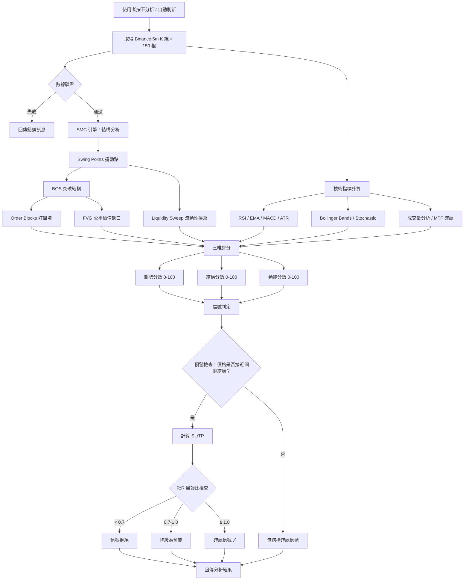
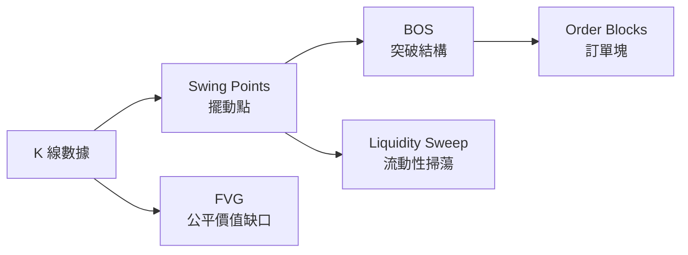
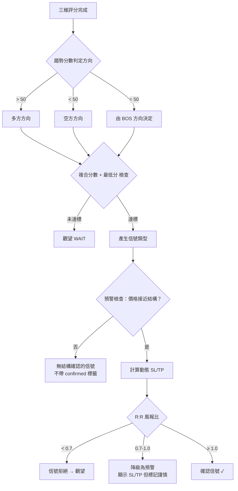

# Scalping Trade Analyzer Pro — 交易者指南

> 版本：v4.2.1 | 本文件完整公開系統所有判斷邏輯、權重與門檻值

---

## 目錄

1. [總覽](#1-總覽)
2. [數據取得與驗證](#2-數據取得與驗證)
3. [SMC 引擎 — 市場結構分析](#3-smc-引擎--市場結構分析)
4. [三維評分系統](#4-三維評分系統)
5. [兩階段信號機制](#5-兩階段信號機制)
6. [動態止損止盈](#6-動態止損止盈sltp)
7. [MTF 多時間框架確認](#7-mtf-多時間框架確認)
8. [時間與有效性](#8-時間與有效性)
9. [如何解讀分析結果](#9-如何解讀分析結果)

---

## 1. 總覽

Scalping Trade Analyzer Pro 是一套加密貨幣剝頭皮交易信號分析系統。它結合 **Smart Money Concepts (SMC)** 市場結構分析與**傳統技術指標**，透過三維評分與兩階段信號機制，為交易者提供進場判斷的輔助參考。

**重要聲明**：本系統是分析輔助工具，不是自動交易系統。所有信號僅供參考，最終進出場決策由交易者自行負責。

### 端到端流程總覽



---

## 2. 數據取得與驗證

### 數據來源

系統從 **Binance 公開 API** 取得 K 線（蠟燭圖）數據，不需要 API 金鑰。

| 參數 | 值 | 說明 |
|------|-----|------|
| 時間框架 | 5 分鐘 (5m) | 固定，適合剝頭皮交易 |
| K 線數量 | 150 根 | 涵蓋最近約 12.5 小時 |
| 重試機制 | 最多 3 次 | 指數退避（1s → 2s → 4s） |

### 數據窗口

每次分析取得 **150 根 5 分鐘 K 線**，相當於最近 **12.5 小時**的市場數據。這意味著：

- 所有指標和結構分析都基於這 12.5 小時的數據
- 超過此窗口的歷史結構（如昨天的 Order Block）不會被偵測
- 每次刷新都重新取得最新數據，不使用快取

### 驗證規則

數據通過四項檢查才會進入分析：

| 檢查項目 | 規則 | 處理方式 |
|----------|------|----------|
| 數量檢查 | 至少 50 根 K 線 | 不足則拒絕分析 |
| 零成交量 | volume = 0 的 K 線 | 跳過（最後一根除外，可能尚未收盤） |
| 時間戳連續性 | 時間必須嚴格遞增 | 跳過異常 K 線 |
| 異常波動 | 單根 K 線波動 > 50% | 保留但記錄警告 |

---

## 3. SMC 引擎 — 市場結構分析

SMC（Smart Money Concepts）是一套基於機構交易者行為的市場分析方法。系統透過五個元件依序分析市場結構：



### 3.1 Swing Points（擺動點）

擺動點是市場的局部高點和低點，代表價格的轉折處。

**判定規則**：以中心 K 線為基準，左右各 **3 根** K 線（共 7 根窗口）：
- **Swing High**：中心 K 線的最高價 ≥ 左右各 3 根 K 線的最高價
- **Swing Low**：中心 K 線的最低價 ≤ 左右各 3 根 K 線的最低價

**保留數量**：最近 **20 個**擺動點（按時間排序）

**交易意義**：擺動點標示出市場的支撐與阻力水平，後續的 BOS、OB、Sweep 都以擺動點為基礎。

### 3.2 BOS（Break of Structure，突破結構）

BOS 是趨勢方向的核心判定依據。當收盤價突破先前的擺動點，就形成一次結構突破。

**判定規則**：
- **多方 BOS（Bullish）**：某根 K 線的**收盤價** > 先前的 Swing High 價格
- **空方 BOS（Bearish）**：某根 K 線的**收盤價** < 先前的 Swing Low 價格

> 注意：使用收盤價而非最高/最低價，可過濾假突破（wick 穿越但收盤未站穩）。

**交易意義**：最近一次 BOS 的方向決定當前趨勢，是多方還是空方。

### 3.3 Order Blocks（訂單塊，OB）

Order Block 是大型機構交易者在突破前累積部位的區域，被視為強力支撐或阻力。

**識別規則**：
1. 找到每個 BOS 事件
2. 從 BOS 發生的 K 線往回搜尋（最多 20 根），找到**最後一根反向 K 線**
   - 多方 BOS → 找最後一根**看空 K 線**（收盤 < 開盤）→ 形成**多方 OB**（支撐）
   - 空方 BOS → 找最後一根**看多 K 線**（收盤 > 開盤）→ 形成**空方 OB**（阻力）
3. OB 的範圍 = 該 K 線的 open ~ close 區間

**有效性條件**：
- 多方 OB：當前價格必須仍在 OB 底部以上（未跌破）
- 空方 OB：當前價格必須仍在 OB 頂部以下（未突破）

**保留數量**：最近 **5 個**有效 OB

**交易意義**：價格回到 OB 區域時，預期會出現反彈（多方 OB）或受壓（空方 OB）。

### 3.4 FVG（Fair Value Gap，公平價值缺口）

FVG 是市場在快速移動時留下的價格缺口，代表市場效率不足的區域。

**識別規則**（三根 K 線窗口）：
- **多方 FVG**：第 1 根 K 線的最高價 < 第 3 根 K 線的最低價（向上跳空）
- **空方 FVG**：第 1 根 K 線的最低價 > 第 3 根 K 線的最高價（向下跳空）

**填補率計算**：
- 價格從缺口外側回填了多少比例（0% = 完全未填補，100% = 完全填滿）
- **有效 FVG**：填補率 < 50%

**保留數量**：最近 **3 個**未填補 FVG

**交易意義**：未填補的 FVG 傾向被回填，價格進入 FVG 區域時可能出現反應。

### 3.5 Liquidity Sweep（流動性掃蕩）

Liquidity Sweep 是指價格短暫穿越擺動點後迅速反轉，被視為機構交易者掃除散戶止損單的行為。

**三級分類**：

| 級別 | 條件 | 給分 |
|------|------|------|
| **Full Sweep** | wick 穿透擺動點 + 收盤反轉 + 深度 ≥ ATR×0.5 + 後續確認 K 線 | +25 |
| **Partial Sweep** | wick 穿透 + (收盤未反轉但深度 ≥ ATR×0.3) 或 (收盤反轉但無確認) | +15 |
| **Near Sweep** | wick 觸碰擺動點 ± ATR×0.2（接近但未穿透） | +8 |

**判定細節**：
- **穿透方向**：Swing High → 最高價 > 擺動點價格；Swing Low → 最低價 < 擺動點價格
- **收盤反轉**：穿透 Swing High 後收盤 < 擺動點價格（或反之）
- **確認 K 線**：穿透後 1-3 根 K 線內出現延續反轉方向的收盤
- **搜尋範圍**：每個擺動點之後 20 根 K 線內

**保留數量**：最近 **5 個** Sweep

**交易意義**：Full Sweep 是最強的反轉信號之一，代表大資金完成清洗後可能反向推動市場。

---

## 4. 三維評分系統

系統從三個維度評估市場狀況，每個維度獨立打分 **0-100**，最終以加權公式合成複合分數。

### 複合分數公式

```
複合分數 = 趨勢分數 × 0.35 + 結構分數 × 0.40 + 動能分數 × 0.25
```

> 結構分數權重最高（0.40），因為 SMC 結構確認是剝頭皮進場的核心條件。

### 4.1 趨勢分數（Trend Score, 0-100）

衡量當前的趨勢方向與強度。

**計算方式**：先計算原始分（範圍 -100 ~ +100），再加 50 映射到 0-100。

| 元件 | 分數 | 判定條件 |
|------|------|----------|
| BOS 方向 | +30 / -30 | 最近 BOS 為 bullish → +30；bearish → -30 |
| MTF 一致 | +25 / -10 | 15m 趨勢與 BOS 方向一致 → +25；衝突 → -10 |
| MTF（無 BOS 時） | +15 / -15 | 無 BOS 但 15m 有明確趨勢 |
| EMA 排列 | +15 / -15 | EMA(9) > EMA(21) → +15（多頭）；反之 -15 |
| 價格 vs EMA | +10 / -10 | 價格 > EMA(9) → +10；反之 -10 |
| BB 位置 | +10 / -10 | 價格 > BB 中軌 → +10；反之 -10 |

**解讀**：
- **> 50** = 偏多趨勢，分數越高趨勢越明確
- **< 50** = 偏空趨勢
- **= 50** = 趨勢不明朗

**範例**：BOS bullish(+30) + MTF 一致(+25) + EMA 多頭(+15) + 價格>EMA(+10) + BB 上方(+10) = 原始分 90 → 加 50 後超過 100 → 夾鉗為 **100 分**

### 4.2 結構分數（Structure Score, 0-100）

衡量當前價格與 SMC 結構的關係。

| 元件 | 分數 | 判定條件 |
|------|------|----------|
| OB 進入 | +30 | 價格在某個 OB 的 top ~ bottom 範圍內 |
| OB 接近 | +20 | 價格距離 OB 邊界 ≤ ATR×0.5 |
| OB 趨勢一致 | +15 | OB 方向與最近 BOS 方向一致 |
| FVG 進入 | +15 | 價格在 FVG 範圍內 |
| FVG 接近 | +10 | 價格距離 FVG 邊界 ≤ ATR×0.5 |
| Full Sweep | +25 | 最近有完整的流動性掃蕩 |
| Partial Sweep | +15 | 最近有部分掃蕩 |
| Near Sweep | +8 | 最近有接近掃蕩 |
| 深度合理 | +10 | 價格與 OB 中點距離在 0.3×ATR ~ 1.5×ATR |
| 深度過深 | -10 | 價格與 OB 中點距離 > 2.5×ATR |
| OB 已測試 | -15 | OB 之前已被碰觸過（touches ≥ 1） |

**解讀**：分數越高代表價格處於越有利的結構位置。如果結構分數很低，代表價格不在任何有意義的 SMC 結構附近。

### 4.3 動能分數（Momentum Score, 0-100）

衡量當前的動能指標狀態。每個指標都同時評估**反轉模式**與**延續模式**兩種情境，取較高分。

#### RSI 評分

| 模式 | 條件 | 分數 |
|------|------|------|
| 反轉 | RSI 在 30-40 或 60-70（準備反轉區間） | +20 |
| 反轉 | RSI < 25 或 > 75（極端區間） | +10 |
| 延續 | 多頭趨勢 + RSI 在 40-65 | +10 |
| 延續 | 空頭趨勢 + RSI 在 35-60 | +10 |

**RSI 背離**（+15）：
- 看多背離：最近 10 根 K 線的最低價 < 前 10 根的最低價，但 RSI > 35
- 看空背離：最近 10 根 K 線的最高價 > 前 10 根的最高價，但 RSI < 65

#### MACD 評分

| 模式 | 條件 | 分數 |
|------|------|------|
| 反轉 | 柱狀圖由負翻正或由正翻負 | +20 |
| 反轉 | MACD 接近穿越（柱狀圖絕對值 < ATR×0.05） | +10 |
| 反轉 | 金叉或死叉（MACD 線與信號線接近） | +10 |
| 延續 | 多頭趨勢 + MACD > 0 + 柱狀圖 > 0 | +15 |
| 延續 | 空頭趨勢 + MACD < 0 + 柱狀圖 < 0 | +15 |

#### Stochastic 評分

| 模式 | 條件 | 分數 |
|------|------|------|
| 反轉 | %K > %D 且 %K < 30（低位金叉） | +10 |
| 反轉 | %K < %D 且 %K > 70（高位死叉） | +10 |
| 延續 | 多頭趨勢 + %K > %D + %K < 70 | +10 |
| 延續 | 空頭趨勢 + %K < %D + %K > 30 | +10 |

#### 成交量評分

| 條件 | 分數 |
|------|------|
| 成交量比率 > 1.5（放量） | +15 |
| 成交量比率 < 0.8（縮量） | -10 |
| Taker Buy 比例 > 60%（主動買入主導） | +10 |

> 成交量比率 = 當前成交量 / 最近 20 根平均成交量

### 品質分數（相容性指標）

```
品質分數 = (趨勢分數 + 結構分數 + 動能分數) / 3 / 20
```

範圍 0-5，供舊版介面相容使用。

---

## 5. 兩階段信號機制

系統採用**兩階段機制**來確認信號，降低假信號的發生率。



### 5.1 第一階段：信號方向判定

根據趨勢分數決定多空方向，再根據複合分數決定信號強度：

| 條件 | 信號 | 動作 |
|------|------|------|
| 趨勢 > 50 + 複合 ≥ 55 + 最低分 ≥ 30 + 趨勢 ≥ 55 | **強烈買入** | strong_buy |
| 趨勢 > 50 + 複合 ≥ 45 + 最低分 ≥ 25 + 趨勢 ≥ 45 | **考慮買入** | buy |
| 趨勢 < 50 + 複合 ≥ 55 + 最低分 ≥ 30 + 趨勢 ≤ 45 | **強烈賣出** | strong_sell |
| 趨勢 < 50 + 複合 ≥ 45 + 最低分 ≥ 25 + 趨勢 ≤ 55 | **考慮賣出** | sell |
| 趨勢 = 50 + BOS 方向 + 複合 ≥ 45 + 最低分 ≥ 25 | **考慮買入/賣出** | buy/sell |
| 以上皆不滿足 | **觀望** | neutral |

> **最低分（min_floor）** = 三維分數中最低的那個。確保不會因為某個維度嚴重偏低而勉強發出信號。

### 5.2 第二階段：預警與確認

#### 預警觸發條件（任一即可）

| 條件 | 門檻 |
|------|------|
| 接近 Order Block | 距離 OB 邊界 ≤ ATR×0.5 |
| 接近 Swing Point | 距離擺動點 ≤ ATR×0.5 |
| 進入 FVG 區域 | 價格在 FVG 的 top ~ bottom 內 |
| 接近 FVG | 距離 FVG 邊界 ≤ ATR×0.25 |

#### 信號確認的四大條件

所有條件必須**同時滿足**：

1. ✅ 三維分數達標（如上表）
2. ✅ 預警已觸發（價格接近關鍵結構）
3. ✅ SL/TP 計算成功
4. ✅ R:R 風報比 ≥ 1.0

### 5.3 信號標籤

確認信號會附帶標籤，標示觸發原因（優先序）：

| 優先級 | 標籤 | 觸發條件 |
|--------|------|----------|
| 1 | **Sweep 確認** | 偵測到流動性掃蕩 |
| 2 | **OB 反彈** / **OB 壓力** | 價格在 OB 區域內 |
| 3 | **FVG 支撐** / **FVG 阻力** | 價格在 FVG 區域內 |
| 4 | **指標共振** | 無特定結構，純指標達標 |

### 5.4 信號到期

| 信號類型 | 到期時間 |
|----------|----------|
| 預警（Pre-Alert） | 6 根 K 線 = **30 分鐘** |
| 確認信號（Confirmed） | 3 根 K 線 = **15 分鐘** |

到期後信號會自動清除，需要重新滿足條件才會再次觸發。

---

## 6. 動態止損止盈（SL/TP）

系統的止損止盈不使用固定倍數，而是**錨定到 SMC 結構**，並用 ATR 做合理性約束。

### 6.1 止損計算

**錨定優先序**（以買入信號為例）：

| 優先級 | 錨點 | 說明 |
|--------|------|------|
| 1 | 多方 OB 底部 | 最近一個在價格下方的多方 OB 底部 |
| 2 | Swing Low | 最近一個在價格下方的 Swing Low |
| 3 | ATR × 1.5 | 以上都找不到時的預設值 |

**ATR 夾鉗**：無論錨定到哪裡，止損距離會被限制在 **ATR×1.0 ~ ATR×2.5** 之間。

```
止損距離 = max(ATR×1.0, min(ATR×2.5, 錨定距離))
止損價 = 當前價格 - 止損距離  （買入信號）
```

### 6.2 止盈計算

**TP1（第一止盈目標）**：
- 錨點：向上找最近的結構（空方 FVG 底部 / 空方 OB 底部 / Swing High）
- 最小距離保證：ATR×1.0
- 找不到結構時預設：ATR×1.5

**TP2（第二止盈目標，延伸目標）**：
- 錨點：TP1 之上的下一個結構
- 最小距離保證：ATR×2.0
- 找不到結構時預設：ATR×3.0

### 6.3 R:R 風報比

```
R:R = TP1 止盈距離 / 止損距離
```

| R:R 值 | 等級 | 處理 |
|--------|------|------|
| < 0.7 | — | **完全拒絕**，不顯示信號 |
| 0.7 - 1.0 | caution | 降級為預警，保留 SL/TP 資訊但標記「謹慎進場」 |
| ≥ 1.0 | acceptable | 確認信號 |
| ≥ 1.5 | good | 優質信號 |

### 6.4 賣出信號

賣出信號的 SL/TP 邏輯完全對稱：
- 止損錨定：空方 OB 頂部 → Swing High → ATR×1.5
- 止盈錨定：向下找結構（多方 FVG 頂部 / 多方 OB 頂部 / Swing Low）

---

## 7. MTF 多時間框架確認

系統使用 **15 分鐘**時間框架作為趨勢確認。

### 確認方式

在 15m 圖上計算 EMA(20) 和 EMA(50)：
- EMA(20) > EMA(50) → 上升趨勢（uptrend）
- EMA(20) < EMA(50) → 下降趨勢（downtrend）
- 無法判定 → 中性（neutral）

### 對趨勢分數的影響

| 情境 | 影響 |
|------|------|
| 15m 趨勢與 5m BOS 方向**一致** | 趨勢分數 **+25** |
| 15m 趨勢與 5m BOS 方向**衝突** | 趨勢分數 **-10** |
| 無 BOS 但 15m 有上升趨勢 | 趨勢分數 **+15** |
| 無 BOS 但 15m 有下降趨勢 | 趨勢分數 **-15** |

> MTF 確認的數據會被快取，在 15 分鐘 K 線未收盤前不會重複請求。

---

## 8. 時間與有效性

### 8.1 數據窗口

系統每次分析使用 **150 根 5 分鐘 K 線 = 12.5 小時**的數據。

**這意味著**：
- 系統只能看到最近 12.5 小時的市場結構
- 如果一個重要的 Order Block 是 13 小時前形成的，系統看不到它
- 更長期的支撐阻力需要交易者自行判斷

### 8.2 指標收斂時間

各指標需要的最少數據量：

| 指標 | 所需 K 線數 | 所需時間 |
|------|------------|----------|
| RSI(14) | 14 根 | 70 分鐘 |
| EMA(9) | 9 根 | 45 分鐘 |
| EMA(21) | 21 根 | 105 分鐘 |
| MACD(12,26,9) | 35 根 | 175 分鐘 |
| Bollinger Bands(20) | 20 根 | 100 分鐘 |
| Stochastic(14,3) | 16 根 | 80 分鐘 |
| ATR(14) | 14 根 | 70 分鐘 |

系統取 150 根 K 線，所以所有指標都有充分的數據進行計算。指標計算本身不存在「冷啟動」的問題。

### 8.3 SMC 結構與市況的關係

SMC 結構的品質取決於市場本身的波動狀態：

| 市況 | 結構品質 | 預期 |
|------|----------|------|
| 高波動/趨勢明確 | 豐富 | Swing Points 多、BOS 清晰、OB/FVG 充足 → 結構分數較高 |
| 盤整/低波動 | 稀少 | 擺動幅度小、可能沒有 BOS 或 OB → 結構分數偏低，這是正常的 |
| 重大消息衝擊 | 極端 | 可能出現異常大的 FVG 和 Sweep，分數波動劇烈 |

**建議**：結構分數長時間偏低時，代表市場缺乏清晰結構，不適合使用 SMC 策略進場。

### 8.4 信號生命週期

信號不會永遠存在：

| 信號類型 | 有效期 | 說明 |
|----------|--------|------|
| 預警 | **30 分鐘**（6 根 5m K 線） | 價格接近結構但尚未確認 |
| 確認信號 | **15 分鐘**（3 根 5m K 線） | 所有條件達標的進場信號 |

到期後信號自動清除，需重新滿足所有條件才會再次觸發。

### 8.5 Auto-Refresh 與即時性

- 系統預設每 **10 秒**自動刷新一次（可在設定中調整為 2-10 秒）
- 每次刷新都會重新取得最新 K 線數據並完整計算
- 信號狀態會在刷新間保持，直到到期或條件改變

### 8.6 多人使用

系統支援多人同時使用。每次分析請求都是獨立計算，不同使用者查詢不同交易對不會互相影響。查詢相同交易對時，由於看到的市場數據相同，分析結果基本一致。

---

## 9. 如何解讀分析結果

### 9.1 三維分數速讀

| 分數區間 | 趨勢分數意義 | 結構分數意義 | 動能分數意義 |
|----------|-------------|-------------|-------------|
| 0-25 | 強空趨勢 | 遠離所有結構 | 動能極弱或反向 |
| 25-45 | 偏空 | 接近某些結構 | 動能不足 |
| 45-55 | 趨勢不明 | 有一些結構支持 | 動能中性 |
| 55-75 | 偏多 | 良好結構位置 | 動能偏強 |
| 75-100 | 強多趨勢 | 完美結構匯聚 | 動能充沛 |

### 9.2 常見情境

#### 情境 A：確認買入信號

```
趨勢分數: 75    結構分數: 60    動能分數: 45
複合分數: 75×0.35 + 60×0.40 + 45×0.25 = 61.5
最低分: 45
信號: 強烈買入
預警: 已觸發（接近多方 OB）
R:R: 1.8 (good)
→ 確認信號 ✓，標籤: OB 反彈
```

#### 情境 B：預警但未確認

```
趨勢分數: 60    結構分數: 35    動能分數: 30
複合分數: 60×0.35 + 35×0.40 + 30×0.25 = 42.5
最低分: 30
信號: 觀望（複合分數 42.5 < 45，未達標）
預警: 已觸發（接近 Swing Low）
→ 顯示預警提示，提醒留意，但不建議進場
```

#### 情境 C：被 R:R 拒絕

```
趨勢分數: 65    結構分數: 50    動能分數: 40
複合分數: 52.75（達標）
信號: 考慮買入
預警: 已觸發
R:R: 0.6
→ 信號被拒絕（R:R < 0.7），變回觀望
→ 代表止損太遠或止盈太近，風險不划算
```

#### 情境 D：有信號但無結構確認

```
趨勢分數: 70    結構分數: 45    動能分數: 50
複合分數: 55.0（達標）
信號: 強烈買入
預警: 未觸發（不在任何結構附近）
→ 顯示買入方向，但不帶 "confirmed" 標籤
→ 三維指標都看多，但價格不在 SMC 結構的理想進場位置
```

### 9.3 固定參數一覽

系統使用以下固定參數，無需手動調整：

| 參數 | 值 |
|------|-----|
| 主框架 | 5m |
| MTF 確認 | 15m |
| RSI 週期 | 14 |
| RSI 超買 | 70 |
| RSI 超賣 | 30 |
| EMA 快線 | 9 |
| EMA 慢線 | 21 |
| MACD (快/慢/信號) | 12 / 26 / 9 |
| ATR 週期 | 14 |
| BB (週期/標準差) | 20 / 2σ |
| Stochastic (%K / %D) | 14 / 3 (SMA) |
| Swing 窗口 | n=3 |
| 複合分數權重 | 趨勢 0.35 / 結構 0.40 / 動能 0.25 |
| ATR 夾鉗 | 1.0 ~ 2.5 |
| R:R 拒絕門檻 | < 0.7 |
